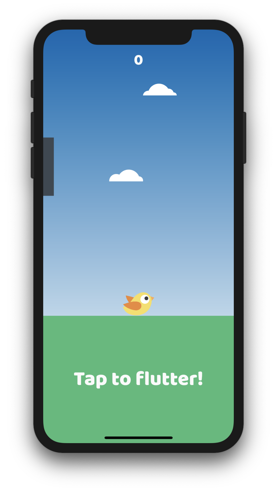

# Flutters

## About

**Flutters** is a demo game powered by [Flutter](https://www.flutter.dev) and [Flame](https://flame-engine.org/). I wrote it to test out its performance and gaming capabilities and decided to open source it, so you can learn to _flutter_ aswell.

### Why is a Flutter Game awesome?

- Apps run on iOS and Android
- Awesome hot-reloading
- Compiles to native
- It is simple to learn

## Contributing

Contributions are what make the open source community such an amazing place to be learn, inspire, and create. Any contributions you make are **greatly appreciated**.

1. Fork the Project
2. Create your Feature Branch (`git checkout -b feature/AmazingFeature`)
3. Commit your Changes (`git commit -m 'Add some AmazingFeature`)
4. Push to the Branch (`git push origin feature/AmazingFeature`)
5. Open a Pull Request

## Special Thanks

- Flutter and Flame Discord community
- [@japalekhin (check out his Flame guides)](https://github.com/japalekhin)

## License

Distributed under the MIT License. See `LICENSE` for more information.
